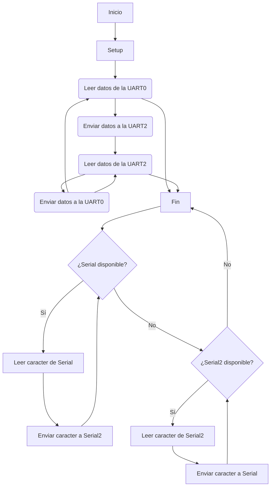

# Practica 8: UART - Universal Asynchronous Receiver/Transmitter

El objetivo de esta práctica es aplicar el cruce entre un teclado y un monitor, lo qual se transmitan los datos especializando los siguientes puertos:

#### - UART0
#### - UART2

## - Transmisión de datos Monitor / Teclado

```c++
#include <Arduino.h>

void setup() {
  Serial.begin(115200);   // Inicializar Serial (UART0)
  Serial2.begin(115200);  // Inicializar Serial2 (UART2)
}

void loop() {
  // Leer datos de la UART0 y enviarlos a la UART2
  if (Serial.available()) {
    char c = Serial.read();
    Serial2.write(c);
  }

  // Leer datos de la UART2 y enviarlos a la UART0
  if (Serial2.available()) {
    char c = Serial2.read();
    Serial.write(c);
  }
}
```

### Funcionamiento y salida puerto serie

En este código permite la comunicación en ambas direcciones entre el Arduino y otros dispositivos conectados a través de UART2, al tiempo que mantiene la capacidad de depuración y comunicación con la computadora a través del puerto USB (UART0). 


#### Salida

La salida por el puerto serie depende de lo que se escriba por teclado 

Si escribimos : práctica Uart

La salida será:

```
práctica Uart
```

### Diagrama de flujo del funcionamiento: 


